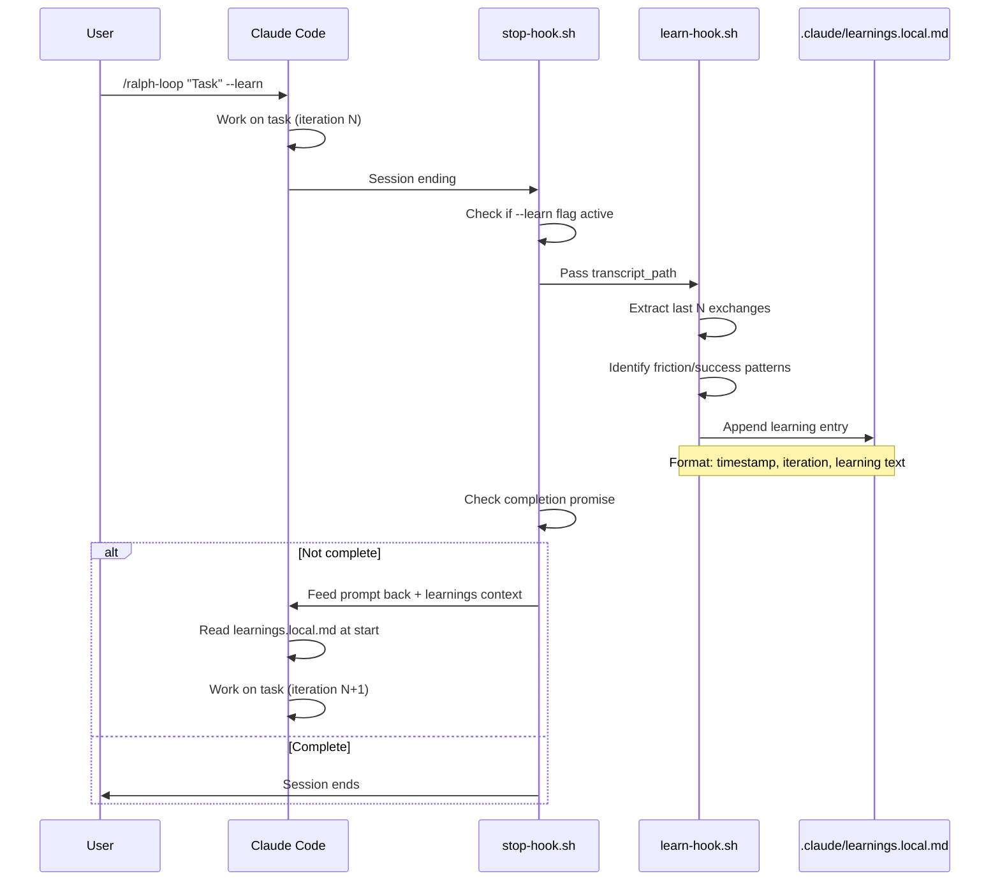

# Plan 1: Minimal Learner (MVP)

**Complexity**: Low | **Time**: 1-2 hours | **Files**: 1 new | **API Cost**: $0

## Overview

The simplest possible self-improving loop. At the end of each Ralph session, extract learnings and append them to a single file. Next Ralph session reads that file.

## ASCII Architecture

```
+------------------+     +-----------------+     +------------------+
|  Ralph Session   |     |   stop-hook.sh  |     | learnings.local  |
|  (Claude Code)   |---->|  (intercepts    |---->|     .md          |
|                  |     |   session end)  |     | (append-only)    |
+------------------+     +-----------------+     +------------------+
        ^                        |                       |
        |                        v                       |
        |               +-----------------+              |
        |               | learn-hook.sh   |              |
        |               | (new - analyzes |<-------------+
        |               |  transcript,    |
        |               |  extracts       |
        |               |  learnings)     |
        |               +-----------------+
        |                        |
        +------------------------+
              (next iteration reads learnings.local.md)
```

## Mermaid Sequence Diagram



## Files to Create/Modify

| File | Action | Purpose |
|------|--------|---------|
| `.claude/plugins/.../ralph-wiggum/.../hooks/stop-hook.sh` | MODIFY | Add learning extraction call |
| `.claude/plugins/.../ralph-wiggum/.../hooks/learn-hook.sh` | CREATE | Extract learnings from transcript |
| `.claude/plugins/.../ralph-wiggum/.../scripts/setup-ralph-loop.sh` | MODIFY | Add `--learn` flag |
| `.claude/plugins/.../ralph-wiggum/.../commands/ralph-loop.md` | MODIFY | Document `--learn` option |

## Key Code

### learn-hook.sh (NEW)

```bash
#!/bin/bash
# Learner Ralph - Extract learnings from transcript

set -euo pipefail

TRANSCRIPT_PATH="$1"
LEARNINGS_FILE=".claude/learnings.local.md"
ITERATION="$2"

# Extract last assistant message
LAST_OUTPUT=$(grep '"role":"assistant"' "$TRANSCRIPT_PATH" | tail -1 | jq -r '
  .message.content |
  map(select(.type == "text")) |
  map(.text) |
  join("\n")
')

# Simple friction detection via keywords
FRICTION_KEYWORDS="error|failed|retry|wrong|actually|correction|fix"
HAS_FRICTION=$(echo "$LAST_OUTPUT" | grep -ciE "$FRICTION_KEYWORDS" || true)

# Create learning entry
TIMESTAMP=$(date -u +%Y-%m-%dT%H:%M:%SZ)

# Extract brief summary (first 500 chars)
SUMMARY=$(echo "$LAST_OUTPUT" | head -c 500 | tr '\n' ' ')

# Append to learnings file
mkdir -p .claude
cat >> "$LEARNINGS_FILE" <<EOF

---
## Iteration $ITERATION | $TIMESTAMP

**Friction detected:** $(if [[ $HAS_FRICTION -gt 0 ]]; then echo "Yes ($HAS_FRICTION signals)"; else echo "No"; fi)

**Session summary:**
$SUMMARY

EOF

echo "Learning captured for iteration $ITERATION"
```

### Modification to stop-hook.sh

Add after line ~130:

```bash
# Extract learnings if --learn flag was set
LEARN_MODE=$(echo "$FRONTMATTER" | grep '^learn:' | sed 's/learn: *//')
if [[ "$LEARN_MODE" == "true" ]]; then
  "${CLAUDE_PLUGIN_ROOT}/hooks/learn-hook.sh" "$TRANSCRIPT_PATH" "$ITERATION" 2>/dev/null || true
fi

# Inject learnings into next prompt
LEARNINGS_FILE=".claude/learnings.local.md"
if [[ -f "$LEARNINGS_FILE" ]]; then
  LEARNINGS_CONTEXT=$(tail -20 "$LEARNINGS_FILE")
  # Append to system message
fi
```

## Pros/Cons

| Pros | Cons |
|------|------|
| Extremely simple - ~100 lines new code | No structured pattern recognition |
| No external dependencies | Learnings file can grow unbounded |
| Works immediately | Naive friction detection (keyword-based) |
| Easy to understand and debug | No categorization of learnings |
| File is human-readable | No deduplication of similar learnings |
| Completely file-based | Learnings may not be actionable |

## When to Use

- Quick validation of the concept
- Low-stakes experimentation
- When API costs are a concern
- As a stepping stone to more complex plans
