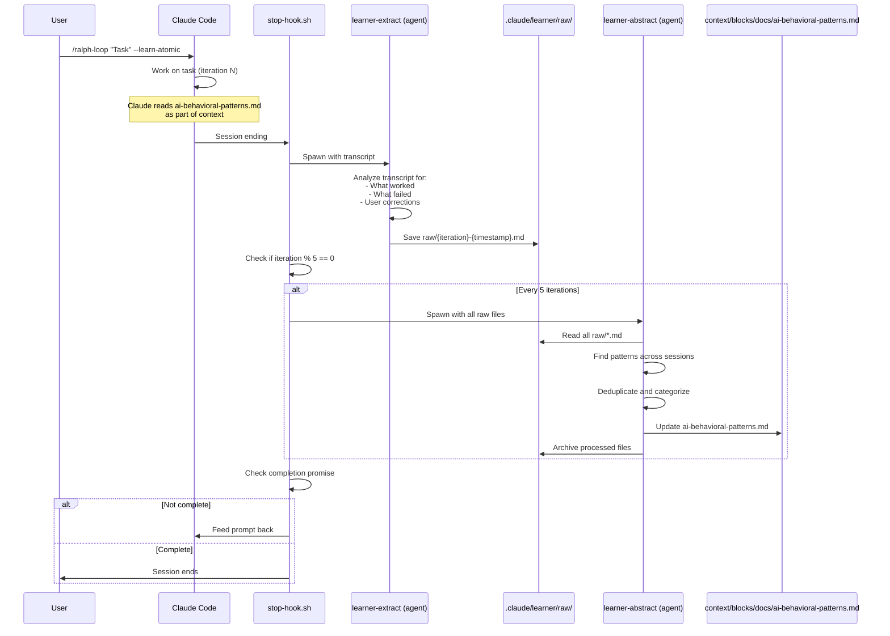

# Plan 2: Atomic Doc Learner

**Complexity**: Medium | **Time**: 4-6 hours | **Files**: 3 new | **API Cost**: Medium

## Overview

Learnings are extracted, analyzed, and stored as atomic documentation in `context/blocks/docs/ai-behavioral-patterns.md`. Uses sub-agents to abstract patterns and compound knowledge over time.

## ASCII Architecture

```
+------------------+     +-----------------+     +------------------+
|  Ralph Session   |     |   stop-hook.sh  |     | Raw Learnings    |
|  (Claude Code)   |---->|  (intercepts    |---->| .claude/learner/ |
|                  |     |   session end)  |     |   raw/{id}.md    |
+------------------+     +-----------------+     +------------------+
        ^                        |                       |
        |                        v                       |
        |               +-----------------+              |
        |               | learner-extract |              |
        |               | (sub-agent)     |<-------------+
        |               +-----------------+
        |                        |
        |                        v
        |               +-----------------+     +------------------+
        |               | learner-abstract|     | Atomic Doc       |
        |               | (sub-agent,     |---->| context/blocks/  |
        |               |  runs every N)  |     | docs/ai-patterns |
        |               +-----------------+     +------------------+
        |                        |                       |
        +------------------------+-----------------------+
              (next iteration reads ai-patterns.md)
```

## Mermaid Sequence Diagram



## Files to Create/Modify

| File | Action | Purpose |
|------|--------|---------|
| `.claude/plugins/.../ralph-wiggum/.../hooks/stop-hook.sh` | MODIFY | Trigger learner agents |
| `.claude/plugins/.../ralph-wiggum/.../scripts/setup-ralph-loop.sh` | MODIFY | Add `--learn-atomic` flag |
| `.claude/agents/learner-extract.md` | CREATE | Sub-agent for raw extraction |
| `.claude/agents/learner-abstract.md` | CREATE | Sub-agent for pattern abstraction |
| `context/blocks/docs/ai-behavioral-patterns.md` | CREATE | Atomic doc for AI learnings |
| `.claude/learner/` | CREATE (dir) | Raw learnings storage |

## Key Code

### learner-extract.md (NEW AGENT)

```markdown
---
name: learner-extract
description: Extract learning signals from a single Ralph iteration. Raw extraction, no abstraction.
model: haiku
allowed-tools: Read, Write, Bash
---

# Learner Extract Agent

Extract learning signals from a Ralph iteration transcript.

## Input

Transcript path passed as argument.

## Signal Types to Extract

| Signal | Indicator | Learning Direction |
|--------|-----------|-------------------|
| User Correction | "no", "wrong", "actually" | What NOT to do |
| Successful Completion | Task done, user satisfied | What TO do |
| Retry/Rework | Same step attempted multiple times | Approach that failed |
| Tool Error | Command failed, file not found | Technical limitation |
| Confusion | "I meant", "let me clarify" | Communication gap |

## Output Format

Save to: `.claude/learner/raw/{iteration}-{timestamp}.md`

```markdown
# Learning Extract: {iteration}

**Timestamp:** {ISO timestamp}
**Task Summary:** {brief task description}

## Signals Extracted

### Signal 1
- **Type:** {signal type}
- **Direction:** DO / DON'T
- **Quote:** "{exact text from transcript}"
- **Context:** {what led to this}
- **Takeaway:** {single sentence learning}

### Signal 2
...

## Raw Stats
- Corrections: {count}
- Successes: {count}
- Failures: {count}
```
```

### learner-abstract.md (NEW AGENT)

```markdown
---
name: learner-abstract
description: Aggregate raw learnings into atomic documentation patterns. Runs every N iterations.
model: sonnet
allowed-tools: Read, Write, Glob, Bash
---

# Learner Abstract Agent

Aggregate raw learnings into the ai-behavioral-patterns.md atomic doc.

## Input

Directory: `.claude/learner/raw/`

## Process

1. Read all `.md` files in raw/
2. Group similar signals by type
3. Identify patterns (3+ similar signals = pattern)
4. Check existing ai-behavioral-patterns.md
5. ADD new patterns (don't duplicate)
6. REINFORCE existing patterns with new evidence
7. Archive processed raw files to `.claude/learner/processed/`

## Output Format for Atomic Doc

Update `context/blocks/docs/ai-behavioral-patterns.md`:

```markdown
# AI Behavioral Patterns

Learned patterns from Ralph iterations. Referenced automatically during development.

## DO Patterns (Positive)

### Pattern: {name}
- **Strength:** {weak|moderate|strong} (based on evidence count)
- **Evidence:** {count} occurrences across {sessions} sessions
- **Summary:** {1-2 sentences}
- **Example:** "{quote from transcript}"

## DON'T Patterns (Anti-patterns)

### Pattern: {name}
- **Strength:** {weak|moderate|strong}
- **Evidence:** {count} occurrences
- **Summary:** {1-2 sentences}
- **Trigger:** {what causes this mistake}
- **Better Approach:** {what to do instead}

## Technical Limitations

### Limitation: {name}
- **Tool/Context:** {what's limited}
- **Workaround:** {if any}
```
```

### ai-behavioral-patterns.md (NEW ATOMIC DOC)

```markdown
---
tags: [core]
---

# AI Behavioral Patterns

Learned patterns from iterative development loops. This document is automatically updated by the Learner Ralph system and should be referenced during development tasks.

## Purpose

Captures what works and what doesn't when Claude works on development tasks. Patterns are extracted from real interactions and reinforced over time.

## DO Patterns (Positive)

{Patterns will be added here by learner-abstract agent}

## DON'T Patterns (Anti-patterns)

{Patterns will be added here by learner-abstract agent}

## Technical Limitations

{Limitations will be documented here}

---

*Last updated: {timestamp}*
*Total patterns: {count}*
*Based on: {session count} sessions*
```

### Modification to stop-hook.sh

```bash
# After line ~130, add learning extraction
LEARN_MODE=$(echo "$FRONTMATTER" | grep '^learn_atomic:' | sed 's/learn_atomic: *//')
if [[ "$LEARN_MODE" == "true" ]]; then
  # Spawn extraction agent (async)
  claude --agent learner-extract --args "$TRANSCRIPT_PATH $ITERATION" &

  # Every 5 iterations, run abstraction
  if [[ $((ITERATION % 5)) -eq 0 ]]; then
    claude --agent learner-abstract &
  fi
fi
```

## Pros/Cons

| Pros | Cons |
|------|------|
| Structured knowledge accumulation | More complex (3 new files) |
| Follows atomic doc patterns | Requires sub-agent spawning |
| Deduplication built-in | Higher API cost (sub-agents) |
| Patterns categorized by type | Abstraction may lose nuance |
| Knowledge compounds over time | Needs periodic manual review |
| Human-readable atomic doc | More points of failure |
| Integrates with existing context system | Takes longer per iteration |

## When to Use

- Already using atomic docs system
- Want structured, categorized learnings
- Willing to pay API costs for better analysis
- Building on Plan 1 success
