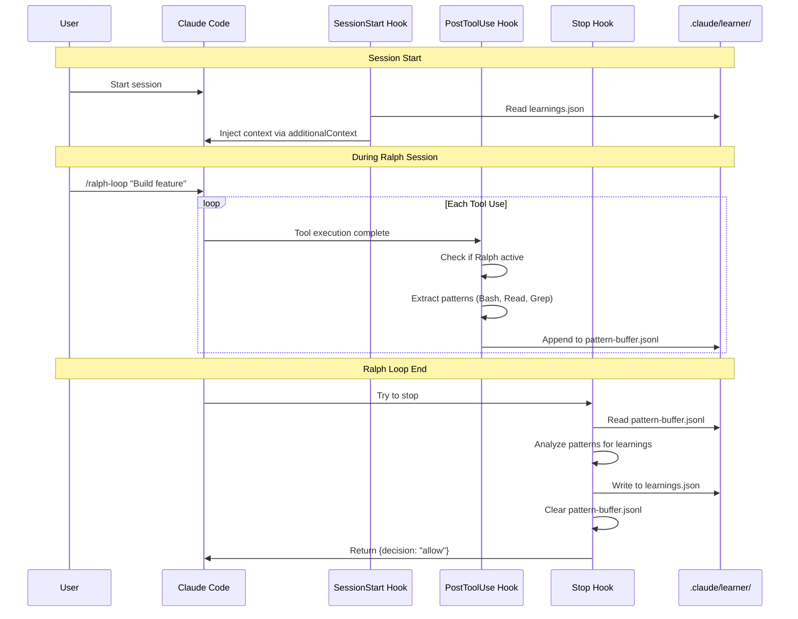

# Plan 3: Hook-Native Learner

**Complexity**: Low-Medium | **Time**: 3-4 hours | **Files**: 4 new | **API Cost**: $0

## Overview

Leverages Claude Code's existing hook infrastructure to passively capture tool usage patterns during Ralph sessions. No sub-agents needed - pure hook-based extraction with heuristic analysis.

## ASCII Architecture

```
┌──────────────────────────────────────────────────────────────────┐
│                    HOOK-NATIVE LEARNER                            │
├──────────────────────────────────────────────────────────────────┤
│                                                                   │
│  ┌─────────────┐    ┌─────────────┐    ┌─────────────┐          │
│  │ SessionStart│    │ PostToolUse │    │    Stop     │          │
│  │    Hook     │    │    Hook     │    │    Hook     │          │
│  └──────┬──────┘    └──────┬──────┘    └──────┬──────┘          │
│         │                  │                   │                  │
│         v                  v                   v                  │
│  ┌─────────────┐    ┌─────────────┐    ┌─────────────┐          │
│  │   Inject    │    │   Capture   │    │   Extract   │          │
│  │  Learnings  │    │  Patterns   │    │  Learnings  │          │
│  │  Context    │    │  to Buffer  │    │  from Buffer│          │
│  └─────────────┘    └─────────────┘    └─────────────┘          │
│                                                                   │
├──────────────────────────────────────────────────────────────────┤
│  .claude/learner/                                                 │
│  ├── learnings.json        (persisted learnings)                 │
│  └── pattern-buffer.jsonl  (session buffer)                      │
└──────────────────────────────────────────────────────────────────┘
```

## Mermaid Sequence Diagram



## Files to Create/Modify

| File Path | Action | Purpose |
|-----------|--------|---------|
| `.claude/plugins/learner-ralph/hooks/hooks.json` | Create | Hook registration |
| `.claude/plugins/learner-ralph/hooks/posttooluse.py` | Create | Pattern capture hook |
| `.claude/plugins/learner-ralph/hooks/stop.py` | Create | Learning extraction hook |
| `.claude/plugins/learner-ralph/hooks/sessionstart.sh` | Create | Context injection hook |
| `.claude/plugins/learner-ralph/.claude-plugin/plugin.json` | Create | Plugin metadata |
| `.claude/learner/learnings.json` | Runtime | Persisted learnings |
| `.claude/learner/pattern-buffer.jsonl` | Runtime | Session buffer |

## Key Code

### hooks.json

```json
{
  "description": "Learner Ralph - Hook-native learning extraction from Ralph sessions",
  "hooks": {
    "PostToolUse": [
      {
        "hooks": [
          {
            "type": "command",
            "command": "python3 ${CLAUDE_PLUGIN_ROOT}/hooks/posttooluse.py",
            "timeout": 5
          }
        ]
      }
    ],
    "Stop": [
      {
        "hooks": [
          {
            "type": "command",
            "command": "python3 ${CLAUDE_PLUGIN_ROOT}/hooks/stop.py",
            "timeout": 30
          }
        ]
      }
    ],
    "SessionStart": [
      {
        "hooks": [
          {
            "type": "command",
            "command": "${CLAUDE_PLUGIN_ROOT}/hooks/sessionstart.sh"
          }
        ]
      }
    ]
  }
}
```

### posttooluse.py (pattern capture)

```python
#!/usr/bin/env python3
"""PostToolUse hook - Capture tool patterns during Ralph sessions."""

import os
import sys
import json
from datetime import datetime

RALPH_STATE = ".claude/ralph-loop.local.md"
PATTERN_BUFFER = ".claude/learner/pattern-buffer.jsonl"

def main():
    try:
        input_data = json.load(sys.stdin)

        # Only capture if Ralph loop is active
        if not os.path.exists(RALPH_STATE):
            print(json.dumps({}))
            sys.exit(0)

        tool_name = input_data.get('tool_name', '')
        tool_input = input_data.get('tool_input', {})
        tool_result = input_data.get('tool_result', {})

        # Extract patterns from exploration tools
        pattern = None
        if tool_name == 'Bash':
            cmd = tool_input.get('command', '')
            if any(x in cmd for x in ['ls', 'find', 'tree']):
                pattern = {'type': 'directory_exploration', 'command': cmd}
        elif tool_name == 'Read':
            pattern = {'type': 'file_read', 'path': tool_input.get('file_path', '')}
        elif tool_name == 'Grep':
            pattern = {'type': 'code_search', 'pattern': tool_input.get('pattern', '')}
        elif tool_name == 'Glob':
            pattern = {'type': 'file_search', 'glob': tool_input.get('pattern', '')}

        if pattern:
            pattern['timestamp'] = datetime.utcnow().isoformat()
            pattern['iteration'] = _get_current_iteration()

            os.makedirs(os.path.dirname(PATTERN_BUFFER), exist_ok=True)
            with open(PATTERN_BUFFER, 'a') as f:
                f.write(json.dumps(pattern) + '\n')

        print(json.dumps({}))
    except Exception as e:
        print(json.dumps({'systemMessage': f'Learner capture error: {e}'}))
    finally:
        sys.exit(0)

def _get_current_iteration():
    """Extract current iteration from Ralph state file."""
    try:
        with open(RALPH_STATE, 'r') as f:
            for line in f:
                if line.startswith('iteration:'):
                    return int(line.split(':')[1].strip())
    except:
        pass
    return 0

if __name__ == '__main__':
    main()
```

### stop.py (learning extraction)

```python
#!/usr/bin/env python3
"""Stop hook - Extract learnings when Ralph session ends."""

import os
import sys
import json
from datetime import datetime
from collections import Counter

RALPH_STATE = ".claude/ralph-loop.local.md"
PATTERN_BUFFER = ".claude/learner/pattern-buffer.jsonl"
LEARNINGS_FILE = ".claude/learner/learnings.json"

def main():
    try:
        input_data = json.load(sys.stdin)

        # Only process if this was a Ralph session ending
        if not os.path.exists(PATTERN_BUFFER):
            print(json.dumps({}))
            sys.exit(0)

        patterns = []
        with open(PATTERN_BUFFER, 'r') as f:
            for line in f:
                if line.strip():
                    patterns.append(json.loads(line))

        if not patterns:
            print(json.dumps({}))
            sys.exit(0)

        # Analyze patterns and extract learnings
        learnings = _extract_learnings(patterns)

        # Merge with existing learnings
        existing = {}
        if os.path.exists(LEARNINGS_FILE):
            with open(LEARNINGS_FILE, 'r') as f:
                existing = json.load(f)

        existing.setdefault('sessions', []).append({
            'timestamp': datetime.utcnow().isoformat(),
            'patterns_count': len(patterns),
            'learnings': learnings
        })

        # Keep last 50 sessions
        existing['sessions'] = existing['sessions'][-50:]

        with open(LEARNINGS_FILE, 'w') as f:
            json.dump(existing, f, indent=2)

        # Clear buffer
        os.remove(PATTERN_BUFFER)

        print(json.dumps({
            'systemMessage': f'Captured {len(learnings)} learnings from Ralph session'
        }))

    except Exception as e:
        print(json.dumps({'systemMessage': f'Learner extraction error: {e}'}))
    finally:
        sys.exit(0)

def _extract_learnings(patterns):
    """Analyze patterns and extract learnings."""
    learnings = []

    # Count file reads
    files_read = [p['path'] for p in patterns if p['type'] == 'file_read']
    file_counts = Counter(files_read)

    # Files read multiple times indicate importance
    for path, count in file_counts.most_common(5):
        if count >= 2:
            learnings.append({
                'type': 'important_file',
                'path': path,
                'read_count': count,
                'insight': f'File {path} was read {count} times - likely a key file'
            })

    # Search patterns indicate codebase structure
    searches = [p['pattern'] for p in patterns if p['type'] == 'code_search']
    if searches:
        learnings.append({
            'type': 'search_patterns',
            'patterns': list(set(searches))[:10],
            'insight': 'Common search terms for this codebase'
        })

    # Directory explorations show architecture
    dirs = [p.get('command', '') for p in patterns if p['type'] == 'directory_exploration']
    if dirs:
        learnings.append({
            'type': 'explored_structure',
            'commands': dirs[:5],
            'insight': 'Directory structure explored during task'
        })

    return learnings

if __name__ == '__main__':
    main()
```

### sessionstart.sh (context injection)

```bash
#!/usr/bin/env bash
# Inject learned patterns as context at session start

LEARNINGS_FILE=".claude/learner/learnings.json"

if [[ ! -f "$LEARNINGS_FILE" ]]; then
  echo '{}'
  exit 0
fi

# Extract recent learnings and format as context
CONTEXT=$(python3 -c "
import json
import sys

try:
    with open('$LEARNINGS_FILE', 'r') as f:
        data = json.load(f)

    sessions = data.get('sessions', [])[-5:]  # Last 5 sessions
    if not sessions:
        print('')
        sys.exit(0)

    context = 'Previous session learnings:\\n'
    for s in sessions:
        for l in s.get('learnings', []):
            context += f\"- {l.get('insight', '')}\\n\"

    print(context)
except:
    print('')
")

if [[ -n "$CONTEXT" ]]; then
  jq -n --arg ctx "$CONTEXT" '{
    "hookSpecificOutput": {
      "hookEventName": "SessionStart",
      "additionalContext": $ctx
    }
  }'
else
  echo '{}'
fi

exit 0
```

## Pros/Cons

| Pros | Cons |
|------|------|
| Minimal code footprint | Limited analysis capability (hooks have timeout constraints) |
| Leverages existing hook infrastructure | Pattern extraction is basic/heuristic-based |
| No new CLI commands needed | Cannot use LLM for deeper analysis within hooks |
| Automatically captures patterns passively | Difficult to extract complex insights |
| Zero user interaction required for learning | No user control over what gets learned |
| Integrates seamlessly with existing Ralph workflow | Learning happens only at session end |
| Zero API cost | |

## When to Use

- Want passive learning without extra steps
- API costs are a concern
- Already comfortable with hook system
- Simple pattern capture is sufficient
