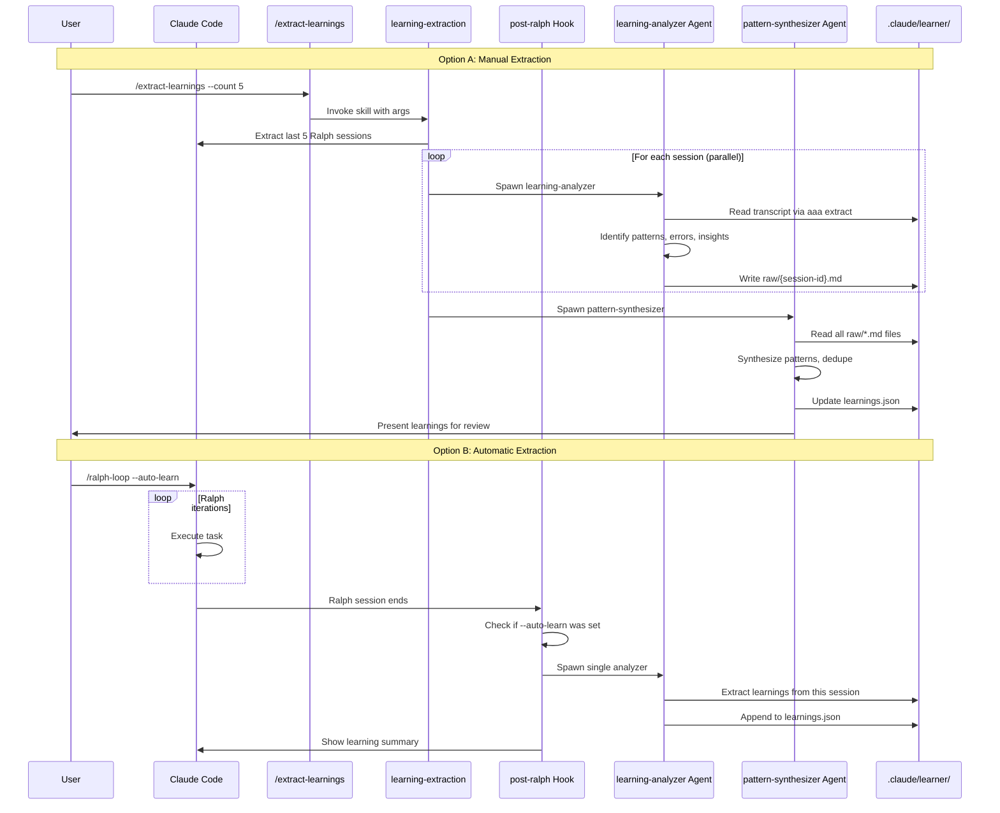

# Plan 4: Full Plugin

**Complexity**: Medium-High | **Time**: 8-10 hours | **Files**: 11+ new | **API Cost**: Per use

## Overview

A full-featured plugin with commands, skills, agents, and hooks working together. Provides both manual and automatic learning extraction with full user control.

## ASCII Architecture

```
+------------------------------------------------------------------+
|                        LEARNER PLUGIN                             |
+------------------------------------------------------------------+
                                |
    +---------------------------+---------------------------+
    |                           |                           |
    v                           v                           v
+------------------+   +------------------+   +------------------+
|    Commands      |   |      Skills      |   |      Hooks       |
+------------------+   +------------------+   +------------------+
| /extract-        |   | learning-        |   | post-ralph       |
|  learnings       |   |  extraction      |   | (Stop hook)      |
|                  |   |                  |   |                  |
| /show-learnings  |   |                  |   | sessionstart     |
|                  |   |                  |   |                  |
| /clear-learnings |   |                  |   |                  |
+------------------+   +------------------+   +------------------+
         |                     |                      |
         v                     v                      v
+------------------------------------------------------------------+
|                       Agents Layer                                |
+------------------------------------------------------------------+
| +------------------------+  +--------------------------------+   |
| | learning-analyzer      |  | pattern-synthesizer            |   |
| | (Stage 1: Extract raw) |  | (Stage 2: Synthesize patterns) |   |
| +------------------------+  +--------------------------------+   |
+------------------------------------------------------------------+
                                |
                                v
+------------------------------------------------------------------+
|                      Persistence Layer                            |
+------------------------------------------------------------------+
| .claude/learner/                                                  |
| ├── learnings.json           # Synthesized learnings             |
| ├── raw/                     # Raw extractions per session        |
| │   └── {session-id}.md                                          |
| └── config.json              # User preferences                   |
+------------------------------------------------------------------+
```

## Mermaid Sequence Diagram



## Files to Create/Modify

| File Path | Action | Purpose |
|-----------|--------|---------|
| `.claude/plugins/learner/` | Create | Plugin root |
| `.claude/plugins/learner/.claude-plugin/plugin.json` | Create | Plugin metadata |
| `.claude/plugins/learner/hooks/hooks.json` | Create | Hook registration |
| `.claude/plugins/learner/hooks/post-ralph.py` | Create | Automatic extraction hook |
| `.claude/plugins/learner/hooks/sessionstart.sh` | Create | Context injection |
| `.claude/plugins/learner/commands/extract-learnings.md` | Create | Manual extraction command |
| `.claude/plugins/learner/commands/show-learnings.md` | Create | View learnings command |
| `.claude/plugins/learner/commands/clear-learnings.md` | Create | Clear learnings command |
| `.claude/plugins/learner/skills/learning-extraction/SKILL.md` | Create | Orchestration skill |
| `.claude/plugins/learner/agents/learning-analyzer.md` | Create | Raw extraction agent |
| `.claude/plugins/learner/agents/pattern-synthesizer.md` | Create | Synthesis agent |
| `tools/src/commands/ralph/index.ts` | Modify | Add --auto-learn flag |
| `.claude/plugins/.../ralph-wiggum/hooks/stop-hook.sh` | Modify | Pass auto-learn to hook |

## Key Code

### plugin.json

```json
{
  "name": "learner",
  "version": "1.0.0",
  "description": "Learn from Ralph sessions - extract patterns, insights, and best practices from iterative development loops. Integrates with ralph-wiggum plugin.",
  "author": {
    "name": "all-agents",
    "email": "dev@all-agents.io"
  },
  "dependencies": {
    "plugins": ["ralph-wiggum"]
  }
}
```

### commands/extract-learnings.md

```markdown
---
description: "Extract learnings from Ralph sessions"
argument-hint: "[--count N] [--session-id ID] [--all]"
allowed-tools: ["Task", "Bash", "Read", "Glob", "Write"]
---

# Extract Learnings Command

Extract patterns and insights from Ralph sessions.

## Arguments

- `--count N`: Analyze last N Ralph sessions (default: 5)
- `--session-id ID`: Analyze specific session
- `--all`: Analyze all available sessions

## Execution

1. Parse arguments to determine which sessions to analyze
2. Invoke the `learning-extraction` skill with arguments
3. The skill will orchestrate the multi-agent analysis workflow.
```

### skills/learning-extraction/SKILL.md

```markdown
---
name: learning-extraction
description: Orchestrate learning extraction from Ralph sessions. Use when user wants to extract patterns, insights, or learnings from previous development sessions.
allowed-tools: Task, Bash, Read, Glob, Write, AskUserQuestion
---

# Learning Extraction Skill

Orchestrates a 2-stage workflow to extract learnings from Ralph sessions.

## Workflow

### Stage 0: Preparation

1. Parse arguments for `--count N`, `--session-id`, or `--all`
2. Identify Ralph session transcripts to analyze:

```bash
aaa extract-conversations --limit 20 --format json | jq '[.[] | select(.summary | test("ralph|loop|iteration"; "i"))]'
```

3. Check existing files in `.claude/learner/raw/` to skip already-processed sessions

### Stage 1: Raw Learning Extraction (Parallel)

For each session to analyze:

1. Check if `.claude/learner/raw/{session-id}.md` already exists
2. If not exists, spawn a `learning-analyzer` agent

**Spawn up to 5 agents in parallel.**

### Stage 2: Pattern Synthesis (Sequential)

After ALL Stage 1 agents complete:

1. Verify all expected raw files exist
2. Spawn single `pattern-synthesizer` agent

### Stage 3: User Review

1. Read generated `.claude/learner/learnings.json`
2. Present top learnings to user
3. Use AskUserQuestion for approval
4. Update config to enable/disable learnings injection
```

### agents/learning-analyzer.md

```markdown
---
name: learning-analyzer
description: Stage 1 agent - Extract raw learnings from a single Ralph session. Focus on patterns, errors encountered, and insights.
model: sonnet
---

# Learning Analyzer (Stage 1)

You analyze a SINGLE Ralph session to extract learnings. Focus on what was discovered, what worked, and what didn't.

## Learning Categories

| Category | What to Extract |
|----------|-----------------|
| Codebase Navigation | Key files, directory structure, entry points |
| Patterns Discovered | Design patterns, coding conventions, architecture |
| Errors & Solutions | Errors encountered and how they were resolved |
| Tool Usage | Effective commands, search patterns, file patterns |
| Iteration Insights | What improved across iterations, what was wasted effort |
| Domain Knowledge | Business logic, terminology, constraints learned |

## Output Format

Save to: `.claude/learner/raw/{session-id}.md`

```markdown
# Learnings: {session-id}

**Analyzed:** {timestamp}
**Iterations:** {count}
**Task:** {brief description}

## Codebase Navigation

### Key Files
- `path/to/file.ts` - [Why it matters]

### Entry Points
- [Description of main entry points discovered]

## Patterns Discovered

### Pattern: {name}
**Where:** {file or area}
**Description:** {what the pattern is}
**Example:**
```code
{code snippet}
```

## Errors & Solutions

### Error: {brief description}
**Iteration:** {when encountered}
**Error:** {actual error message}
**Solution:** {how it was fixed}
**Prevention:** {how to avoid in future}

## Effective Commands

| Command | Purpose |
|---------|---------|
| {cmd} | {why useful} |

## Iteration Insights

- **Iteration 1-N:** {what was learned/improved}
- **Wasted Effort:** {what to avoid}

## Domain Knowledge

- {insight about the codebase/domain}
```
```

### agents/pattern-synthesizer.md

```markdown
---
name: pattern-synthesizer
description: Stage 2 agent - Synthesize patterns across multiple raw learning extractions. Deduplicate, prioritize, and structure for injection.
model: sonnet
---

# Pattern Synthesizer (Stage 2)

You synthesize learnings from multiple raw extraction files into a coherent, deduplicated knowledge base.

## Synthesis Rules

1. **DEDUPLICATE** - Merge similar learnings
2. **PRIORITIZE** - Rank by frequency and impact
3. **GENERALIZE** - Abstract patterns where possible
4. **STRUCTURE** - Organize for easy injection

## Output Format

Save to: `.claude/learner/learnings.json`

```json
{
  "version": 1,
  "lastUpdated": "ISO-timestamp",
  "sessionsAnalyzed": ["id1", "id2"],

  "codebase": {
    "keyFiles": [
      {
        "path": "src/main.ts",
        "importance": "high",
        "reason": "Main entry point",
        "sessions": ["id1", "id2"]
      }
    ],
    "structure": {
      "summary": "Brief architecture description",
      "entryPoints": ["path/to/entry1"],
      "testLocations": ["tests/"]
    }
  },

  "patterns": [
    {
      "name": "Pattern name",
      "description": "What the pattern is",
      "frequency": 3,
      "files": ["where it appears"],
      "example": "code snippet"
    }
  ],

  "effectiveCommands": [
    {
      "command": "grep -r 'pattern' src/",
      "purpose": "Find X in codebase",
      "frequency": 5
    }
  ],

  "commonErrors": [
    {
      "error": "TypeError: ...",
      "cause": "Why it happens",
      "solution": "How to fix",
      "frequency": 2
    }
  ],

  "domainKnowledge": [
    {
      "insight": "Business rule or constraint",
      "importance": "high",
      "source": "session-id"
    }
  ]
}
```
```

### Modification to ralph/index.ts

```typescript
// Add to existing command options
.option("--auto-learn", "Extract learnings after session completes")
.action((iterations, options) => {
    // ... existing validation ...

    // If auto-learn enabled, create marker file
    if (options.autoLearn) {
        const fs = require('fs');
        const path = require('path');
        const markerDir = '.claude/learner';
        fs.mkdirSync(markerDir, { recursive: true });
        fs.writeFileSync(path.join(markerDir, 'auto-learn.flag'),
            new Date().toISOString());
    }

    // ... rest of existing code ...
});
```

## Pros/Cons

| Pros | Cons |
|------|------|
| Full-featured with manual and automatic extraction | Higher complexity |
| LLM-powered analysis via sub-agents | More files to maintain |
| User control over what gets learned and applied | Requires Task agent spawning (API costs) |
| Scalable architecture (parallel agents) | Longer extraction time |
| Rich, structured learnings storage | More potential failure points |
| Can be extended with more agent types | Plugin dependency management needed |
| Follows existing all-agents patterns (friction-analyzer style) | |

## When to Use

- Want full control over learning extraction
- Need manual + automatic modes
- Willing to invest in comprehensive solution
- Already familiar with plugin architecture
