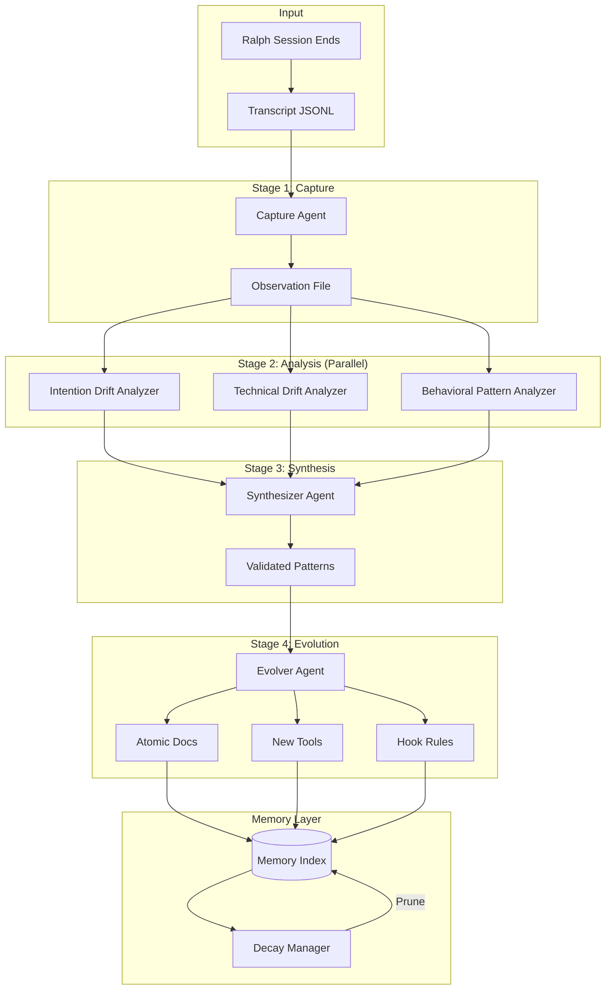
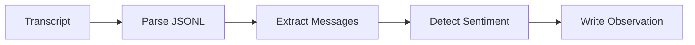
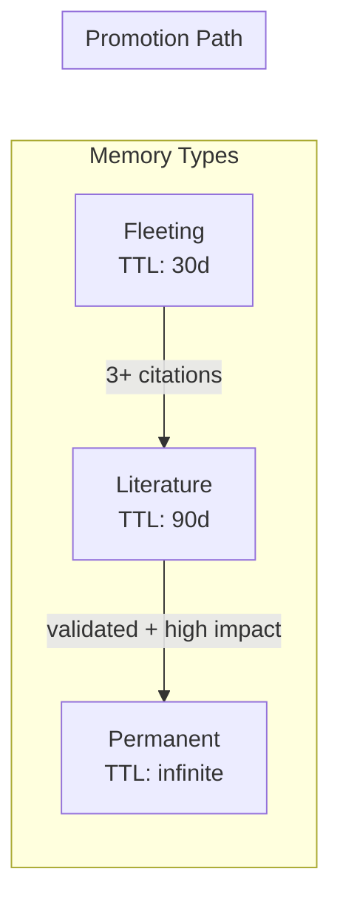

# Plan 5: Full Multi-Agent Learner System

**Complexity**: High | **Time**: 8 weeks | **Files**: 20+ new | **API Cost**: High

## Overview

Enterprise-grade self-improving system with 6 specialized agents, Zettelkasten-inspired memory layer, automated decay, error firewalls, and phased rollout.

## Master Architecture

```
                    ┌─────────────────────────────────┐
                    │         LEARNER RALPH           │
                    │      Multi-Agent System         │
                    └─────────────────────────────────┘
                                   │
         ┌─────────────────────────┼─────────────────────────┐
         │                         │                         │
         ▼                         ▼                         ▼
┌─────────────────┐    ┌─────────────────┐    ┌─────────────────┐
│     CAPTURE     │    │    ANALYZERS    │    │   SYNTHESIZER   │
│     AGENT       │    │   (3 parallel)  │    │      AGENT      │
│                 │    │                 │    │                 │
│ ┌─────────────┐ │    │ ┌─────────────┐ │    │ ┌─────────────┐ │
│ │ Ralph Hook  │ │    │ │  Intention  │ │    │ │  Pattern    │ │
│ │ Stop Event  │ │    │ │    Drift    │ │    │ │  Deduping   │ │
│ └─────────────┘ │    │ ├─────────────┤ │    │ ├─────────────┤ │
│ ┌─────────────┐ │    │ │  Technical  │ │    │ │  Conflict   │ │
│ │ Transcript  │ │    │ │    Drift    │ │    │ │  Resolution │ │
│ │  Parsing    │ │    │ ├─────────────┤ │    │ ├─────────────┤ │
│ └─────────────┘ │    │ │ Behavioral  │ │    │ │ Threshold   │ │
│ ┌─────────────┐ │    │ │  Patterns   │ │    │ │ Evaluation  │ │
│ │ Observation │ │    │ └─────────────┘ │    │ └─────────────┘ │
│ │   Writer    │ │    │                 │    │                 │
│ └─────────────┘ │    │                 │    │                 │
└─────────────────┘    └─────────────────┘    └─────────────────┘
         │                         │                         │
         │                         │                         │
         ▼                         ▼                         ▼
┌──────────────────────────────────────────────────────────────┐
│                     MEMORY LAYER (Zettelkasten)               │
│  context/learnings/                                           │
│  ├── observations/    # Fleeting (TTL: 30d)                  │
│  ├── patterns/        # Literature (TTL: 90d)                │
│  ├── decisions/       # Permanent                            │
│  ├── tools/           # Generated skills                     │
│  ├── rules/           # Generated hooks                      │
│  └── index.json       # Graph + decay metadata               │
└──────────────────────────────────────────────────────────────┘
         │                                                   │
         ▼                                                   ▼
┌─────────────────┐                              ┌─────────────────┐
│     EVOLVER     │                              │     DECAY       │
│      AGENT      │                              │    MANAGER      │
│                 │                              │                 │
│ Doc updates     │                              │ 30d → archive   │
│ Tool creation   │                              │ 90d → promote   │
│ Hook generation │                              │ 3+ cites = keep │
│ CLAUDE.md edits │                              │ 0 cites = purge │
└─────────────────┘                              └─────────────────┘
```

## Agent Data Flow



## The 6 Specialized Agents

### 1. Capture Agent
**Purpose**: Convert raw transcript to structured observation
**Input**: Transcript JSONL path
**Output**: `context/learnings/observations/{timestamp}-{session}.md`



### 2. Intention Drift Analyzer
**Purpose**: Detect when goals shifted during session
**Signals**:
- User corrections ("no", "I meant", "actually")
- Goal restatements
- Abandoned tasks

### 3. Technical Drift Analyzer
**Purpose**: Check compliance with specs/docs
**Signals**:
- API misuse
- Pattern violations
- Type errors

### 4. Behavioral Pattern Analyzer
**Purpose**: Find repetitive behaviors (good and bad)
**Signals**:
- Tool sequences repeated 3+ times
- Same file read multiple times
- Retry loops

### 5. Synthesizer Agent
**Purpose**: Merge findings, resolve conflicts, filter by confidence
**Process**:
1. Deduplicate similar findings
2. Resolve conflicts (evidence weight, recency, authority)
3. Apply confidence threshold (0.7+)
4. Evaluate tool-worthiness

### 6. Evolver Agent
**Purpose**: Apply learnings to system artifacts
**Outputs**:
- Update atomic docs
- Create new tools/skills
- Generate hook rules
- Edit CLAUDE.md

## Memory Layer Structure

```
context/learnings/
├── observations/          # Fleeting notes (TTL: 30 days)
│   ├── 20260108-143022-sess-abc.md
│   └── ...
│
├── patterns/              # Literature notes (TTL: 90 days)
│   ├── PAT-001-edit-without-read.md
│   └── ...
│
├── decisions/             # Permanent notes
│   ├── DEC-001-always-glob-first.md
│   └── ...
│
├── tools/                 # Generated tools/skills
│   └── TOOL-001-verify-before-edit.md
│
├── rules/                 # Generated hook rules
│   └── RULE-001-require-read.yaml
│
└── index.json             # Memory graph + decay metadata
```

## Memory Decay Mechanism



| Type | Default TTL | Promotion Criteria | Archive Condition |
|------|-------------|-------------------|-------------------|
| Observation | 30 days | - | 1+ citations |
| Pattern | 90 days | 3+ citations + validated | 3+ citations |
| Decision | Infinite | - | Never |
| Tool | Infinite | - | Never |
| Rule | Infinite | - | Never |

## Tool-Worthiness Evaluation

A pattern becomes "tool-worthy" when ALL criteria met:

| Criterion | Threshold | Rationale |
|-----------|-----------|-----------|
| Frequency | 5+ occurrences | Not a one-off |
| Impact | 10+ minutes saved | Worth automating |
| Confidence | 0.8+ | High certainty |
| Automatable | true | Can be coded |
| Effort | low or medium | ROI positive |

## Conflict Resolution Strategies

1. **Evidence Weight**: More evidence wins
2. **Recency Bias**: `weight = base * (0.95 ^ days_old)`
3. **Source Authority**: User corrections > tool errors > inferred
4. **Majority Voting**: 3+ quorum required
5. **Manual**: Flag for human review

## Error Firewall

Each stage isolated to prevent cascade failures:

```typescript
async function executeWithContainment<T>(
  agent: LearnerAgent,
  input: AgentInput,
  fallback: T
): Promise<T> {
  try {
    const result = await agent.execute(input);
    if (!validateQualityGate(result)) {
      return fallback;
    }
    return result.data as T;
  } catch (error) {
    logError(agent.name, error);
    return fallback;
  }
}
```

## Phased Rollout Plan

### Phase 0: Foundation (Week 1)
- Create `context/learnings/` structure
- Implement core types
- Set up decay cron placeholder

### Phase 1: Capture (Week 2)
- Create capture agent
- Implement capture hook
- Test with 10 manual Ralph runs

### Phase 2: Analyzers (Weeks 3-4)
- Create 3 analyzer agents
- Build parallel orchestrator
- Implement error firewall

### Phase 3: Synthesizer (Week 5)
- Create synthesizer agent
- Implement conflict resolution
- Build threshold evaluator

### Phase 4: Evolver (Week 6)
- Create evolver agent
- Implement doc/tool/hook generators
- Build staging system

### Phase 5: Integration (Weeks 7-8)
- CLI commands (`/learner:*`)
- Skill orchestrator
- Memory decay automation
- Documentation

## CLI Commands

| Command | Purpose |
|---------|---------|
| `/learner:capture` | Manual capture trigger |
| `/learner:analyze` | Run analyzers on observations |
| `/learner:synthesize` | Synthesize patterns |
| `/learner:evolve` | Apply learnings |
| `/learner:status` | Show memory stats |
| `/learner:decay` | Run decay manually |

## Complete File Structure

```
all-agents/
├── context/learnings/              # Memory layer
├── tools/src/commands/learner/     # CLI commands
├── tools/src/lib/learner/          # Shared utilities
│   ├── types.ts
│   ├── memory.ts
│   ├── firewall.ts
│   ├── threshold.ts
│   └── prompts/
├── .claude/agents/
│   ├── learner-capture.md
│   ├── learner-intention-drift.md
│   ├── learner-technical-drift.md
│   ├── learner-behavioral-pattern.md
│   ├── learner-synthesizer.md
│   └── learner-evolver.md
├── .claude/skills/learner-ralph/
└── .claude/commands/learner/
```

## Pros/Cons

| Pros | Cons |
|------|------|
| Most comprehensive solution | Highest complexity |
| Multiple analysis perspectives | 8 week implementation |
| Automated memory management | High API costs |
| Error isolation | Many moving parts |
| Self-healing through decay | Requires ongoing maintenance |
| Can generate new tools automatically | Steep learning curve |

## When to Use

- Building a long-term learning system
- Have budget for implementation
- Want automated knowledge management
- Need multiple analysis perspectives
- Plan to run many Ralph sessions
