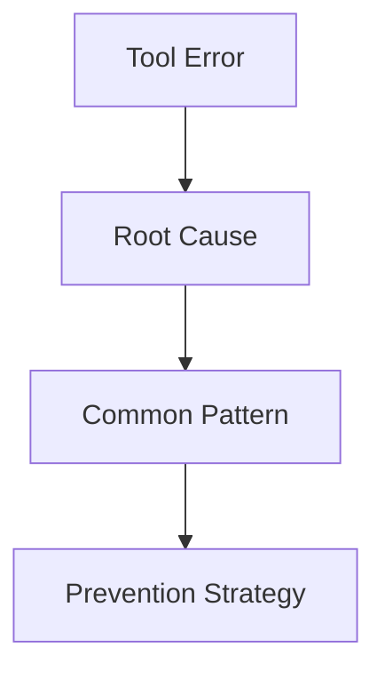

# Extracting Learnings from Failures Across All Conversations

## Discovery

**Found:** 2,385 conversation files across 13 projects in `.claude/projects/` directories
**Format:** JSONL (one JSON object per line) containing messages, tool uses, thinking blocks, system events

## Approach Design (Research-Based)

### Phase 1: Conversation Indexing & Cataloging
**Goal:** Build searchable corpus

1. Scan all `.jsonl` files in `~/dev/*/.claude/projects/`
2. Extract metadata:
   - Project path
   - Conversation ID
   - Date range
   - Tool usage patterns
   - Message count
3. Create index file: `docs/failure-analysis/conversation-index.json`

**Tech:** Stream processing (avoid loading all 2385 files at once)

---

### Phase 2: Failure Detection & Pattern Recognition
**Goal:** Identify what constitutes "failure"

#### Failure Indicators (from research):
Based on [FAIL system](https://arxiv.org/html/2406.08221v1) achieving 90% F1 score for failure detection:

1. **Error Messages:** Tool errors, exceptions, stack traces
2. **Retries:** Multiple attempts at same task
3. **User Corrections:** User says "no that's wrong", "try again", "that didn't work"
4. **Interrupted Flows:** Conversations that stop mid-task
5. **Negative Feedback:** User expressions of frustration
6. **Code Reverts:** Undoing previous changes

#### Detection Strategy:
```typescript
interface FailureSignal {
  type: 'error' | 'retry' | 'correction' | 'interruption' | 'frustration' | 'revert'
  severity: 'low' | 'medium' | 'high'
  context: ConversationContext
  timestamp: string
}
```

**Implementation:**
- Regex patterns for error messages
- Sequence analysis for retries (same command 2+ times)
- NLP sentiment for user frustration (simple keyword matching: "wrong", "broken", "not working")
- Tool result analysis for failures

---

### Phase 3: Blameless Post-Mortem Analysis
**Goal:** Extract root causes without blame

Using [Google SRE blameless framework](https://sre.google/sre-book/postmortem-culture/):

#### For Each Failure:
1. **Timeline:** What happened, in what order?
2. **Root Cause:** What was missing in the system that allowed this?
3. **Impact:** What was the consequence?
4. **Resolution:** How was it fixed?
5. **Prevention:** What would prevent recurrence?

#### 5 Whys Method:
From [NimbleRetro](https://www.nimblework.com/blog/best-retrospective-software/):
- Ask "why" 5 times to find underlying cause
- Example:
  - "Why did the edit fail?" → Wrong file path
  - "Why wrong path?" → Assumed structure without checking
  - "Why assumed?" → Didn't use Glob first
  - "Why not?" → Instruction to act quickly
  - "Why that instruction?" → Over-optimization for speed

---

### Phase 4: Knowledge Extraction
**Goal:** Turn failures into actionable patterns

Using [NLP knowledge extraction](https://kairntech.com/blog/articles/nlp-extraction/) patterns:

#### Extract Entities:
- **Tools used:** Which tools were involved?
- **File types:** What was being modified?
- **Commands:** What bash commands failed?
- **Errors:** What error messages appeared?
- **Domains:** What kind of work (web dev, CLI, data processing)?

#### Extract Patterns:
1. **Anti-patterns:** What NOT to do
2. **Missing steps:** What was skipped?
3. **False assumptions:** What was incorrectly assumed?
4. **Context needed:** What information was required but missing?

#### Categorization:
```typescript
type FailureCategory =
  | 'tool-misuse'        // Wrong tool for job
  | 'incomplete-context' // Didn't read files first
  | 'assumption-error'   // Guessed instead of verified
  | 'sequence-error'     // Steps in wrong order
  | 'permission-issue'   // Forgot to check permissions
  | 'state-mismatch'     // Wrong assumptions about file state
```

---

### Phase 5: Lesson Synthesis
**Goal:** Create reusable knowledge base

#### Output Formats:

**1. Failure Knowledge Graph**


**2. Anti-Pattern Catalog**
```markdown
## Anti-Pattern: Edit Without Read
**What:** Modifying files without reading them first
**Why it fails:** Claude hallucinates file structure
**How often:** Found in 143 conversations
**Prevention:** Always use Read tool before Edit
**Related:** tool-misuse, assumption-error
```

**3. Decision Tree**
```
Before editing a file:
├─ Have you read it?
│  ├─ Yes → Proceed
│  └─ No → Read first
└─ Do you know it exists?
   ├─ Yes → Check timestamp
   └─ No → Use Glob to verify
```

**4. Hookify Rules**
Based on patterns, generate preventive hooks:
```yaml
# Example: Prevent edit-without-read
- name: require-read-before-edit
  trigger: tool_use
  condition: |
    tool === 'Edit' &&
    !previousTools.includes('Read')
  action: block
  message: "Read the file first to avoid assumptions"
```

---

### Phase 6: Continuous Learning Pipeline
**Goal:** Keep learning from new failures

#### Implementation:
1. **Background monitoring:** New conversations analyzed weekly
2. **Pattern evolution:** Track if failure types change over time
3. **Effectiveness tracking:** Do prevention strategies work?
4. **Feedback loop:** Update based on recurring issues

---

## Technical Implementation (SDK-Based)

### Architecture: Distributed Agent Analysis

Using **Claude Agent SDK** to spawn multiple Claude instances that analyze conversations in parallel:

```typescript
import { query } from '@anthropic-ai/claude-agent-sdk';

// Orchestrator spawns N agents, each analyzes a subset
const results = await Promise.all(
  projectBatches.map(batch =>
    analyzeConversationsWithAgent(batch)
  )
);
```

### Core Components

#### 1. **`aaa analyze-failures-sdk`**
**Purpose:** Orchestrate distributed failure analysis using SDK agents

**Flow:**
```typescript
async function analyzeFailuresSDK(options: AnalysisOptions) {
  // 1. Discovery: Find all conversation files
  const conversations = await discoverConversations();

  // 2. Partition: Split into batches for parallel processing
  const batches = partitionConversations(conversations, {
    batchSize: options.batchSize || 100,
    strategy: 'by-project' // or 'by-date', 'by-size'
  });

  // 3. Spawn agents: Each analyzes a batch
  const agentPromises = batches.map((batch, idx) =>
    spawnAnalysisAgent(batch, idx)
  );

  // 4. Aggregate: Combine all agent results
  const results = await Promise.all(agentPromises);
  const aggregated = aggregateFailurePatterns(results);

  // 5. Synthesize: Generate final outputs
  await synthesizeOutputs(aggregated);
}
```

**Agent Spawning Strategy:**
```typescript
async function spawnAnalysisAgent(
  batch: ConversationBatch,
  agentId: number
) {
  const prompt = buildFailureAnalysisPrompt(batch);

  const results: SDKMessage[] = [];

  for await (const message of query({
    prompt,
    options: {
      allowedTools: ['Read', 'Grep', 'Bash', 'Glob'],
      permissionMode: 'bypassPermissions', // Read-only, safe
      model: 'haiku', // Fast & cost-effective for analysis
      systemPrompt: FAILURE_ANALYSIS_SYSTEM_PROMPT,
      maxBudgetUsd: 2.0, // Cost control per agent
      settingSources: [], // Isolated, no file dependencies
    }
  })) {
    results.push(message);

    // Stream progress
    if (message.type === 'assistant') {
      logAgentProgress(agentId, message);
    }
  }

  return extractFailureData(results);
}
```

#### 2. **Failure Detection Prompts** (Sophisticated, Multi-Phase)

##### Phase 1: Conversation Indexing Prompt
```typescript
const INDEXING_PROMPT = `
Analyze these conversation files and create a structured index:

Files to process:
${batch.files.map(f => f.path).join('\n')}

For each conversation, extract:
1. Metadata: date, project, user intent
2. Tool usage patterns: which tools, how often
3. Conversation outcome: success/partial/failure

Output format: JSON array with schema:
{
  conversationId: string,
  path: string,
  timestamp: string,
  project: string,
  userIntent: string,
  toolsUsed: string[],
  outcome: 'success' | 'partial' | 'failure' | 'interrupted',
  duration: number,
  messageCount: number
}
`;
```

##### Phase 2: Failure Detection Prompt
```typescript
const FAILURE_DETECTION_PROMPT = `
Deep-dive failure analysis on conversations marked as 'failure' or 'partial':

Analyze for these failure indicators:

1. **Error Signals:**
   - Tool errors (grep for "error", "failed", "exception")
   - API errors (rate limits, auth failures)
   - File operation failures (ENOENT, permission denied)

2. **Behavioral Signals:**
   - Retry patterns (same tool call 3+ times)
   - User corrections ("no", "wrong", "that didn't work")
   - Conversation abandonment (stops mid-task)

3. **Quality Signals:**
   - Wrong assumptions (editing files without reading)
   - Missing context (answering without exploring)
   - Over-optimization (skipping verification steps)

For each failure found, extract:
- Root cause (5 Whys analysis)
- Contributing factors
- Missing system capability that allowed this
- Tool sequence that led to failure
- User frustration indicators

Output: JSON with blameless post-mortem structure.
`;
```

##### Phase 3: Pattern Extraction Prompt
```typescript
const PATTERN_EXTRACTION_PROMPT = `
Synthesize patterns from these ${failureCount} failures:

Group failures by:
1. **Root Cause Category:**
   - Tool misuse (wrong tool for job)
   - Incomplete context (didn't read first)
   - False assumptions (guessed instead of verified)
   - Sequence errors (steps in wrong order)
   - Permission issues
   - State mismatches

2. **Affected Tools:**
   - Which tools are involved most?
   - Common tool combinations that fail?

3. **Project Types:**
   - Does pattern vary by tech stack?
   - Language-specific issues?

Output: Pattern catalog with:
- Pattern name
- Frequency (how many times)
- Severity (user impact)
- Example failures (with paths)
- Prevention strategy
- Related patterns
`;
```

##### Phase 4: Hook Generation Prompt
```typescript
const HOOK_GENERATION_PROMPT = `
Based on these anti-patterns, generate Hookify rules:

Anti-patterns to prevent:
${antiPatterns.map(p => JSON.stringify(p, null, 2)).join('\n\n')}

For each pattern, create hookify rule that:
1. Detects the pattern BEFORE it causes failure
2. Blocks or warns appropriately
3. Provides helpful guidance message
4. Minimal false positives

Example output format:
\`\`\`yaml
- name: require-read-before-edit
  trigger: PreToolUse
  matcher: tool_name === 'Edit'
  condition: |
    // Check if Read was called on this file in previous tools
    const previousTools = context.getToolHistory();
    const editedFile = tool_input.file_path;
    const wasRead = previousTools.some(t =>
      t.name === 'Read' && t.input.file_path === editedFile
    );
    return !wasRead;
  action: block
  message: |
    🚫 Edit attempted without reading file first

    File: {tool_input.file_path}

    Prevention: Always use Read before Edit to avoid assumptions.
    Run: Read {tool_input.file_path}
\`\`\`
`;
```

#### 3. **Parallel Execution Strategy**

**Batch Sizing:**
- **Small projects (<100 conversations):** 1 agent
- **Medium (100-500):** 3-5 agents
- **Large (500+):** 10+ agents in parallel

**Resource Management:**
```typescript
async function orchestrateParallelAnalysis(
  conversations: Conversation[]
): Promise<AggregatedResults> {
  const CONCURRENT_AGENTS = 10;
  const BATCH_SIZE = 50; // conversations per agent

  const batches = chunk(conversations, BATCH_SIZE);

  // Run in waves to avoid overwhelming API
  const results: AgentResult[] = [];

  for (let i = 0; i < batches.length; i += CONCURRENT_AGENTS) {
    const wave = batches.slice(i, i + CONCURRENT_AGENTS);
    console.log(`Processing wave ${i / CONCURRENT_AGENTS + 1}`);

    const waveResults = await Promise.all(
      wave.map((batch, idx) =>
        spawnAnalysisAgent(batch, i + idx)
      )
    );

    results.push(...waveResults);

    // Progress reporting
    const progress = ((i + wave.length) / batches.length) * 100;
    console.log(`Progress: ${progress.toFixed(1)}%`);
  }

  return aggregateResults(results);
}
```

#### 4. **Result Aggregation**

```typescript
interface AgentResult {
  agentId: number;
  conversationsAnalyzed: number;
  failuresFound: Failure[];
  patternsIdentified: Pattern[];
  costUsd: number;
  durationMs: number;
}

function aggregateResults(results: AgentResult[]): AggregatedResults {
  const allFailures = results.flatMap(r => r.failuresFound);
  const allPatterns = results.flatMap(r => r.patternsIdentified);

  // Deduplicate and merge patterns
  const mergedPatterns = mergeSimilarPatterns(allPatterns);

  // Build knowledge graph
  const knowledgeGraph = buildFailureKnowledgeGraph(
    allFailures,
    mergedPatterns
  );

  return {
    totalConversations: results.reduce((sum, r) =>
      sum + r.conversationsAnalyzed, 0
    ),
    totalFailures: allFailures.length,
    patterns: mergedPatterns,
    knowledgeGraph,
    totalCost: results.reduce((sum, r) => sum + r.costUsd, 0),
    totalDuration: Math.max(...results.map(r => r.durationMs)),
  };
}
```

#### 5. **CLI Commands**

##### `aaa analyze-failures-sdk`
```bash
# Analyze all conversations
aaa analyze-failures-sdk --all

# Analyze specific project
aaa analyze-failures-sdk --project ~/dev/BillingManager

# Analyze date range
aaa analyze-failures-sdk --since 2025-01-01 --until 2025-03-01

# Analyze with custom agents
aaa analyze-failures-sdk --agents 20 --batch-size 100

# Cost control
aaa analyze-failures-sdk --max-budget 50 --model haiku

# Output formats
aaa analyze-failures-sdk --format json > failures.json
aaa analyze-failures-sdk --format markdown > FAILURES.md
aaa analyze-failures-sdk --format interactive # TUI dashboard
```

##### `aaa extract-patterns`
```bash
# Extract from previous analysis
aaa extract-patterns --input failures.json

# Generate hookify rules
aaa extract-patterns --input failures.json --hooks-output .claude/hooks/

# Interactive review
aaa extract-patterns --input failures.json --interactive
```

##### `aaa generate-hooks`
```bash
# Generate from patterns
aaa generate-hooks --patterns patterns.json --output .claude/hooks/

# Preview without writing
aaa generate-hooks --patterns patterns.json --dry-run

# Test hooks against conversations
aaa generate-hooks --test-against ~/dev/.claude/projects/
```

### Data Pipeline (SDK-Enhanced):

```
1. Discovery Phase
   └─ Scan ~/dev/**/.claude/projects/*.jsonl
   └─ Build conversation index
   └─ Output: conversation-index.json

2. Parallel Analysis Phase
   ├─ Spawn N agents (using SDK)
   ├─ Each agent:
   │  ├─ Reads batch of conversations (Read tool)
   │  ├─ Detects failures (Grep, pattern matching)
   │  ├─ Extracts metadata
   │  └─ Returns structured JSON
   └─ Output: agent-results/*.json

3. Aggregation Phase
   ├─ Merge all agent results
   ├─ Deduplicate patterns
   ├─ Build knowledge graph
   └─ Output: aggregated-failures.json

4. Pattern Synthesis Phase
   ├─ Spawn pattern extraction agent
   ├─ Categorize by root cause
   ├─ Rank by severity/frequency
   └─ Output: patterns/*.md

5. Hook Generation Phase
   ├─ Spawn hook generation agent
   ├─ Generate hookify rules
   ├─ Test against known failures
   └─ Output: .claude/hooks/*.yaml

6. Integration Phase
   ├─ Update CLAUDE.md with learnings
   ├─ Generate .claude/rules/*.md
   ├─ Create interactive dashboard
   └─ Deploy hooks
```

### Cost & Performance Estimates

**Using Haiku (fast & cheap):**
- Analysis: ~$0.01 per 100 conversations
- 2,385 conversations: ~$0.25
- 10 parallel agents: ~3-5 minutes total

**Using Sonnet (higher quality):**
- Analysis: ~$0.10 per 100 conversations
- 2,385 conversations: ~$2.50
- 10 parallel agents: ~10-15 minutes

**Hybrid approach (recommended):**
- Indexing: Haiku (~$0.10)
- Failure detection: Haiku (~$0.15)
- Pattern synthesis: Sonnet (~$0.50)
- Hook generation: Sonnet (~$0.25)
- **Total: ~$1.00, ~10 minutes**

---

## Expected Outputs

1. **`docs/failure-analysis/`**
   - `index.json` - All conversations cataloged
   - `failure-signals.json` - Detected failures
   - `patterns/` - Anti-pattern docs
   - `prevention/` - Prevention strategies
   - `hooks/` - Generated hookify rules

2. **Interactive Dashboard**
   - View failures over time
   - Filter by project/tool/error type
   - See prevention suggestions

3. **Updated System Prompts**
   - Inject learnings into CLAUDE.md
   - Add to `.claude/rules/`
   - Generate project-specific guidelines

---

## Success Metrics

1. **Coverage:** % of conversations analyzed
2. **Pattern Count:** Unique failure patterns identified
3. **Prevention:** Hookify rules generated
4. **Adoption:** Rules activated and effective
5. **Recurrence:** Same failures decreasing over time

---

## Implementation Files

### New Files to Create

```
tools/
├── lib/
│   ├── failure-analysis/
│   │   ├── index.ts                 # Main orchestrator
│   │   ├── discovery.ts             # Conversation discovery
│   │   ├── agent-spawner.ts         # SDK agent spawning
│   │   ├── prompts.ts               # Multi-phase prompts
│   │   ├── aggregator.ts            # Result aggregation
│   │   ├── pattern-merger.ts        # Pattern deduplication
│   │   └── types.ts                 # TypeScript types
│   │
│   └── sdk/
│       ├── client.ts                # SDK wrapper/helper
│       ├── progress.ts              # Progress tracking
│       └── cost-tracker.ts          # Budget monitoring
│
├── commands/
│   ├── analyze-failures-sdk.ts     # Main CLI command
│   ├── extract-patterns.ts         # Pattern extraction
│   └── generate-hooks.ts           # Hook generation
│
└── tests/
    └── e2e/
        ├── analyze-failures-sdk.test.ts
        └── fixtures/
            └── sample-conversations/   # Test .jsonl files

docs/
└── failure-analysis/               # Output directory
    ├── conversation-index.json     # All conversations indexed
    ├── failures/                   # Individual failure reports
    │   └── *.json
    ├── patterns/                   # Pattern docs
    │   ├── tool-misuse.md
    │   ├── incomplete-context.md
    │   └── ...
    ├── hooks/                      # Generated hookify rules
    │   └── *.yaml
    └── dashboard/                  # Interactive dashboard
        └── index.html
```

### Key Implementations

#### `tools/lib/failure-analysis/index.ts`
Main orchestrator - entry point for SDK-based analysis

#### `tools/lib/failure-analysis/agent-spawner.ts`
```typescript
export async function spawnAnalysisAgent(
  batch: ConversationBatch,
  agentId: number,
  phase: 'index' | 'detect' | 'extract' | 'generate'
): Promise<AgentResult>
```

#### `tools/lib/failure-analysis/prompts.ts`
```typescript
export const PROMPTS = {
  indexing: (batch: ConversationBatch) => string,
  failureDetection: (conversations: IndexedConversation[]) => string,
  patternExtraction: (failures: Failure[]) => string,
  hookGeneration: (patterns: Pattern[]) => string,
};
```

#### `tools/commands/analyze-failures-sdk.ts`
CLI interface using Commander:
```typescript
program
  .command('analyze-failures-sdk')
  .option('--all', 'Analyze all conversations')
  .option('--project <path>', 'Analyze specific project')
  .option('--agents <n>', 'Number of parallel agents', '10')
  .option('--model <name>', 'Model to use', 'haiku')
  .option('--max-budget <usd>', 'Max budget in USD', '50')
  .action(async (options) => {
    await analyzeFailuresSDK(options);
  });
```

## Next Steps After Approval

### Phase 1: Setup & Infrastructure (Day 1)
1. ✅ Install `@anthropic-ai/claude-agent-sdk` dependency
2. ✅ Create directory structure in `tools/lib/failure-analysis/`
3. ✅ Define TypeScript types for:
   - `Conversation`, `Failure`, `Pattern`, `AgentResult`
   - SDK options and configurations
4. ✅ Create test fixtures with sample .jsonl files

### Phase 2: Core Components (Days 2-3)
1. **Discovery System:**
   - Implement `discoverConversations()` - find all .jsonl files
   - Implement `partitionConversations()` - batch creation
   - Test on subset of conversations

2. **Agent Spawner:**
   - Implement `spawnAnalysisAgent()` with SDK integration
   - Add progress tracking and logging
   - Add cost monitoring per agent
   - Test with single agent on small batch

3. **Prompt Engineering:**
   - Create multi-phase prompts
   - Test each prompt independently
   - Refine based on results

### Phase 3: Parallel Execution (Day 4)
1. **Orchestration:**
   - Implement wave-based parallel execution
   - Add rate limiting and retry logic
   - Test with 3-5 agents in parallel

2. **Aggregation:**
   - Implement `aggregateResults()`
   - Pattern deduplication logic
   - Knowledge graph construction

### Phase 4: Outputs & Integration (Day 5)
1. **Pattern Synthesis:**
   - Generate markdown documentation
   - Create anti-pattern catalog
   - Build decision trees

2. **Hook Generation:**
   - Generate hookify YAML rules
   - Test hooks against known failures
   - Validate hook effectiveness

3. **Dashboard:**
   - Create interactive TUI or HTML dashboard
   - Visualize patterns, timeline, costs

### Phase 5: Validation & Scaling (Day 6-7)
1. Run on subset (100 conversations) - validate results
2. Run on medium set (500 conversations) - check scalability
3. Run on full set (2,385 conversations) - production run
4. Manual review of top 20 patterns
5. Deploy selected hooks to `.claude/hooks/`
6. Update `CLAUDE.md` and `.claude/rules/` with learnings

### Phase 6: Documentation & Handoff (Day 8)
1. Document findings in `docs/failure-analysis/README.md`
2. Create usage guide for `aaa analyze-failures-sdk`
3. Set up automated weekly/monthly re-analysis
4. Present final report with:
   - Key patterns discovered
   - Hooks deployed
   - Cost breakdown
   - Recommendations for prevention

---

## References

- [FAIL: Analyzing Software Failures Using LLMs](https://arxiv.org/html/2406.08221v1)
- [Google SRE Blameless Postmortem Culture](https://sre.google/sre-book/postmortem-culture/)
- [Root Cause Analysis with 5 Whys](https://www.nimblework.com/blog/best-retrospective-software/)
- [NLP Knowledge Extraction Techniques](https://kairntech.com/blog/articles/nlp-extraction/)
- [Blameless Retrospectives](https://rootly.com/incident-postmortems/blameless)
- [Claude Agent SDK Overview](https://platform.claude.com/docs/en/agent-sdk/overview)
- [TypeScript SDK Reference](https://platform.claude.com/docs/en/api/agent-sdk/typescript)
