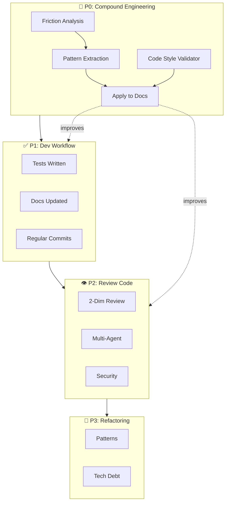

# Roadmap

## Vision Overview

### Summary

| #   | Phase                | Vision                           | Implementation               | Status     |
| --- | -------------------- | -------------------------------- | ---------------------------- | ---------- |
| 1   | Plan Feature         | Brainwriting for ideation        | `brainwriting` skill         | ⏯️ beta    |
| 2   | Plan Code            | Deep research + planning         | CLI + agents + plugins       | ⏯️ mixed   |
| 3   | Setup Repo           | Scaffold + CLAUDE.md             | `aaa setup`                  | ⚠️ partial |
| 4   | Write Code           | Consistent code, implement plans | `feature-dev` plugin         | ⏯️ plugin  |
| 5   | Fix Code             | Iterative loop until success     | -                            | ❌ missing |
| 6   | Refactor Code        | TBD                              | `refactoring.md` placeholder | ❌ missing |
| 7   | Maintain Code        | Tech debt payback                | -                            | ❌ missing |
| 8   | Infrastructure       | IaC support                      | -                            | ❌ missing |
| 9   | Test Code            | Workflow + test writer agent     | docs only                    | ❌ missing |
| 10  | Check Code           | ESLint fixers orchestration      | pre-commit hooks             | ⚠️ partial |
| 11  | Document Code        | End-of-impl subagent             | `/context:atomic-doc`        | ⏯️ beta    |
| 12  | Review Code          | 2-dim review + multi-agent       | `/dev:code-review`           | ⏯️ beta    |
| 13  | Deploy Code          | CI/CD pipeline                   | `release.yml` only           | ⚠️ partial |
| 14  | Version Code         | Semantic + AI changelog          | semantic-release             | ✅ stable  |
| 15  | Compound Engineering | Learn from AI feedback loops     | friction analysis            | ⏯️ beta    |

### Priorities

| Priority | Phase(s) | Focus | Rationale |
|----------|----------|-------|-----------|
| **P0** | 15 | Compound Engineering | Self-improving docs - reduces re-prompting, catches gaps |
| **P1** | 4, 9, 11 | Dev Workflow | Tests written, docs updated, commits regular |
| **P2** | 12 | Review Code | Catch what slips through workflow |
| **P3** | 6 | Refactoring | Later, when maintaining larger codebases |

### Vision Details

#### 1. Plan Feature

**Vision:** Brainwriting with command - Working well enough for brainstorming.

| Type  | Name           | Status  |
| ----- | -------------- | ------- |
| Skill | `brainwriting` | ⏯️ beta |

#### 2. Plan Code

**Vision:**

- Deep research: 5-7 parallel web searches → synthesized summary
- GitHub code search via CLI/MCP (lacks semantic search)
- External: Gemini CLI, Parallel Web Search
- Research current repo: Explorer agent
- Get docs from links: extract as markdown
- High/Low Level Planning: ❓ needs technique

| Type    | Name                  | Vision Item               | Status     |
| ------- | --------------------- | ------------------------- | ---------- |
| CLI     | `aaa gh-search`       | GitHub search             | ⏯️ exp     |
| CLI     | `aaa gemini-research` | External research         | ⏯️ exp     |
| CLI     | `aaa parallel-search` | Deep research             | ⏯️ beta    |
| CLI     | `aaa download`        | Get docs from links       | ⏯️ beta    |
| Command | `/gh-search`          | GitHub search             | ⏯️ exp     |
| Command | `/gemini-research`    | External research         | ⏯️ exp     |
| Command | `/parallel-search`    | Deep research             | ⏯️ beta    |
| Command | `/download`           | Get docs from links       | ⏯️ beta    |
| Agent   | `gemini-research`     | External research         | ⏯️ exp     |
| Agent   | `parallel-search`     | Deep research             | ⏯️ beta    |
| Plugin  | `code-explorer`       | Research current repo     | ⏯️ plugin  |
| Plugin  | `code-architect`      | High level planning       | ⏯️ plugin  |
| -       | -                     | Multi-agent orchestration | ❌ missing |
| -       | -                     | Low level planning        | ❌ missing |

#### 3. Setup Code Repository

**Vision:** Scaffold project. CLAUDE.md file with docs?

| Type | Name                         | Vision Item         | Status     |
| ---- | ---------------------------- | ------------------- | ---------- |
| CLI  | `aaa setup --user/--project` | Claude Code config  | ✅ stable  |
| -    | -                            | Project scaffolding | ❌ missing |
| -    | -                            | CLAUDE.md template  | ❌ missing |

#### 4. Write Code `P1`

**Vision:** Consistent code, following best practices. Implement Low/High Level Plans.

| Type    | Name                    | Vision Item          | Status    |
| ------- | ----------------------- | -------------------- | --------- |
| Plugin  | `feature-dev`           | Guided feature dev   | ⏯️ plugin |
| Plugin  | `frontend-design`       | Frontend design      | ⏯️ plugin |
| Docs    | `context/blocks/`       | Coding standards     | ✅ stable |
| Command | `/dev:start-feature`    | Start feature branch | ✅ stable |
| Command | `/dev:complete-feature` | Merge feature        | ✅ stable |

#### 5. Fix Code

**Vision:** Iterable loop with verification. Until it errors, keep trying.

| Type | Name | Status     |
| ---- | ---- | ---------- |
| -    | -    | ❌ missing |

#### 6. Refactor Code `P3`

**Vision:** ❓ (needs research/definition)

| Type | Name             | Status         |
| ---- | ---------------- | -------------- |
| Docs | `refactoring.md` | ❌ placeholder |

#### 7. Maintain Code

**Vision:** Payback tech debt / modernising ❓

| Type | Name | Status     |
| ---- | ---- | ---------- |
| -    | -    | ❌ missing |

#### 8. Infrastructure as Code

**Vision:** ❓ (needs research/definition)

| Type | Name | Status     |
| ---- | ---- | ---------- |
| -    | -    | ❌ missing |

#### 9. Test Code `P1`

**Vision:**

- Part of dev workflow: research → plan → implement → test
- Each implementation must have a test
- Hooks should be used
- Test writer agent (PostHog pattern)

| Type | Name                   | Vision Item        | Status     |
| ---- | ---------------------- | ------------------ | ---------- |
| Docs | `context/blocks/test/` | Testing principles | ✅ stable  |
| -    | -                      | Test writer agent  | ❌ missing |
| -    | -                      | TDD workflow       | ❌ missing |
| -    | -                      | Test hooks         | ❌ missing |

#### 10. Check Code

**Vision:** spawn-eslint-fixers orchestrator calling multiple fix subagents - 🟢/🔴 situation.

| Type   | Name       | Vision Item         | Status     |
| ------ | ---------- | ------------------- | ---------- |
| Hook   | pre-commit | ESLint integration  | ✅ stable  |
| Plugin | `hookify`  | Pattern guards      | ⏯️ plugin  |
| -      | -          | spawn-eslint-fixers | ❌ missing |
| -      | -          | Security scanning   | ❌ missing |

#### 11. Document Code `P1`

**Vision:** Part of general instructions. Perhaps subagent for end-of-implementation with good prompting to catch discrepancies.

| Type     | Name                     | Vision Item           | Status     |
| -------- | ------------------------ | --------------------- | ---------- |
| Workflow | `dev-lifecycle-simple`   | Manual doc workflow   | ✅ stable  |
| Command  | `/context:atomic-doc`    | Atomic doc management | ⏯️ beta    |
| Command  | `/dev:consistency-check` | Discrepancy checker   | ⏯️ beta    |
| -        | -                        | Doc writer agent      | ❌ missing |

#### 12. Review Code `P2`

**Vision:**

- Reviews on 2 dimensions: technical quality + intent alignment
- Prioritizes: Critical → Functional → Improvements → Style
- Could use more subagents for different perspectives (security, etc.)

| Type     | Name                    | Vision Item         | Status     |
| -------- | ----------------------- | ------------------- | ---------- |
| Command  | `/dev:code-review`      | Code review command | ⏯️ beta    |
| Workflow | `code-review.md`        | 2-dimension review  | ✅ doc     |
| Plugin   | `pr-review-toolkit`     | Multi-agent review  | ⏯️ plugin  |
| Agent    | `coding-style-reviewer` | Style review        | ⏯️ beta    |
| -        | -                       | Security reviewer   | ❌ missing |

#### 13. Deploy Code

**Vision:** CI/CD should do.

| Type     | Name          | Vision Item        | Status     |
| -------- | ------------- | ------------------ | ---------- |
| Workflow | `release.yml` | Release automation | ✅ stable  |
| -        | -             | CI pipeline (PRs)  | ❌ missing |
| -        | -             | Quality gates      | ❌ missing |

#### 14. Version Code

**Vision:** Semantic versioning. AI-generated CHANGELOG if better.

| Type    | Name                        | Vision Item          | Status     |
| ------- | --------------------------- | -------------------- | ---------- |
| Tool    | semantic-release            | Semantic versioning  | ✅ stable  |
| Command | `/dev:git-commit`           | Conventional commits | ✅ stable  |
| Command | `/dev:git-multiple-commits` | Multiple commits     | ✅ stable  |
| -       | -                           | AI changelog         | ❌ missing |

#### 15. Compound Engineering `P0`

**Vision:** Learn from continuous AI feedback loops. Extract insights from coding sessions, identify friction patterns, compound improvements to prompts/docs/workflows over time.

| Type  | Name                             | Vision Item                   | Status     |
| ----- | -------------------------------- | ----------------------------- | ---------- |
| CLI   | `aaa extract-conversations`      | Extract AI session history    | ✅ stable  |
| Skill | `analyze-friction`               | 3-stage friction workflow     | ⏯️ beta    |
| Agent | `conversation-friction-analyzer` | Raw friction extraction       | ⏯️ beta    |
| Agent | `friction-pattern-abstractor`    | Pattern finding & grouping    | ⏯️ beta    |
| Skill | `dev-work-summary`               | Daily git activity review     | ⏯️ beta    |
| -     | -                                | Auto-run friction analysis    | ❌ missing |
| -     | -                                | Metrics/insights dashboard    | ❌ missing |
| -     | -                                | CLAUDE.md auto-improvement    | ❌ missing |
| -     | -                                | Prompt effectiveness tracking | ❌ missing |
| -     | -                                | Code example validator (coding-style.md) | ❌ missing |

---

## Current Implementation Status

**Status Legend:**

- ✅ **STABLE** - Works reliably, tested
- ⏯️ **BETA/EXPERIMENTAL** - Exists but needs validation
- ⏭️ **TODO** - Planned, not started
- ❓ **UNKNOWN** - Needs research/design
- ❌ **MISSING** - Vision expects it, nothing exists

### 1. Plan Feature

| Item         | Status  | Implementation       | Notes                     |
| ------------ | ------- | -------------------- | ------------------------- |
| Brainwriting | ⏯️ beta | `brainwriting` skill | Works, requires plan mode |

### 2. Plan Code

#### 2.1 Deep Research Online

| Item                               | Status      | Implementation    | Notes                                         |
| ---------------------------------- | ----------- | ----------------- | --------------------------------------------- |
| Deep research subagent             | ⏯️ beta     | `parallel-search` | Requires paid API key                         |
| Research multi-agent orchestration | ⏭️          | -                 | Vision: researcher→critique→finaliser pattern |
| GitHub code search                 | ⏯️ exp      | `gh-search`       | Works, lacks semantic search                  |
| Perplexity Deep Research           | ❌ rejected | -                 | Too expensive ($1.4), essay output            |
| Gemini CLI research                | ⏯️ exp      | `gemini-research` | Tests failing, needs fix                      |
| Parallel Web Search                | ⏯️ beta     | `parallel-search` | Works with API key                            |
| DeepWiki MCP                       | ❌          | -                 | Vision mentions, not integrated               |
| Orchestrate searches               | ⏭️          | -                 | Skills can do this, undocumented              |

#### 2.2 Research Current Repository

| Item           | Status    | Implementation             | Notes                    |
| -------------- | --------- | -------------------------- | ------------------------ |
| Explorer agent | ⏯️ plugin | `code-explorer` (external) | From claude-code-plugins |

#### 2.3 Get Docs from Links

| Item                      | Status  | Implementation      | Notes |
| ------------------------- | ------- | ------------------- | ----- |
| Download URLs as markdown | ⏯️ beta | `/download` command | Works |

#### 2.4 Planning

| Item                | Status | Implementation            | Notes                                     |
| ------------------- | ------ | ------------------------- | ----------------------------------------- |
| High Level Planning | ❓     | `code-architect` (plugin) | Vision asks "any technique?" - unanswered |
| Low Level Planning  | ❓     | -                         | No commit-level breakdown tool            |

#### 2.5 Organize Work

| Type    | Name               | Vision Item           | Status    |
| ------- | ------------------ | --------------------- | --------- |
| CLI     | `aaa task create`  | Create task files     | ✅ stable |
| CLI     | `aaa story create` | Create story files    | ✅ stable |
| Skill   | `task-create`      | Task creation skill   | ✅ stable |
| Skill   | `story-create`     | Story creation skill  | ✅ stable |
| Command | `/create-task`     | Task creation command | ✅ stable |

### 3. Setup Code Repository

| Item                | Status    | Implementation               | Notes               |
| ------------------- | --------- | ---------------------------- | ------------------- |
| Claude Code config  | ✅ stable | `aaa setup --user/--project` | Works               |
| Project scaffolding | ❌        | -                            | Setup ≠ scaffolding |
| CLAUDE.md template  | ❌        | -                            | No generator        |

### 4. Write Code

| Item                  | Status    | Implementation               | Notes                    |
| --------------------- | --------- | ---------------------------- | ------------------------ |
| Guided feature dev    | ⏯️ plugin | `feature-dev` (external)     | From claude-code-plugins |
| Frontend design       | ⏯️ plugin | `frontend-design` (external) | From claude-code-plugins |
| Coding standards docs | ✅ stable | `context/blocks/`            | Comprehensive            |

### 5. Fix Code

| Item                       | Status | Implementation | Notes                                  |
| -------------------------- | ------ | -------------- | -------------------------------------- |
| Iterative fix loop         | ❌     | -              | Vision: "until it errors, keep trying" |
| Auto-fix with verification | ❌     | -              | Not implemented                        |

### 6. Refactor Code

| Item                 | Status         | Implementation   | Notes              |
| -------------------- | -------------- | ---------------- | ------------------ |
| Refactoring workflow | ❌ placeholder | `refactoring.md` | File is TODO only  |
| Refactoring patterns | ❌             | -                | Nothing documented |

### 7. Maintain Code (Tech Debt)

| Item                   | Status | Implementation | Notes          |
| ---------------------- | ------ | -------------- | -------------- |
| Tech debt tracking     | ❌     | -              | Nothing exists |
| Modernization workflow | ❌     | -              | Nothing exists |
| Dependency audit       | ❌     | -              | Nothing exists |

### 8. Infrastructure as Code

| Item        | Status | Implementation | Notes                           |
| ----------- | ------ | -------------- | ------------------------------- |
| IaC support | ❌     | -              | Vision has "?" - nothing exists |

### 9. Test Code

| Item              | Status    | Implementation         | Notes                            |
| ----------------- | --------- | ---------------------- | -------------------------------- |
| Test writer agent | ❌        | -                      | Vision links PostHog example     |
| TDD workflow      | ❌        | -                      | Not implemented                  |
| Test hooks        | ❌        | -                      | hookify exists but no test hooks |
| Testing docs      | ✅ stable | `context/blocks/test/` | Principles documented            |

### 10. Check Code (Lint/Security)

| Item                | Status         | Implementation       | Notes                         |
| ------------------- | -------------- | -------------------- | ----------------------------- |
| ESLint integration  | ✅ stable      | pre-commit hooks     | Works                         |
| spawn-eslint-fixers | ❌             | -                    | Vision link 404s, not in repo |
| Security scanning   | ❌ placeholder | `SECURITY.md`        | Empty file                    |
| hookify guards      | ⏯️ plugin      | `hookify` (external) | Blocks patterns, not fixes    |

### 11. Document Code

| Item                | Status    | Implementation           | Notes                             |
| ------------------- | --------- | ------------------------ | --------------------------------- |
| Manual doc workflow | ✅ stable | dev-lifecycle-simple     | Built into workflow               |
| atomic-doc command  | ⏯️ beta   | `/context:atomic-doc`    | Manual process                    |
| Doc writer agent    | ❌        | -                        | Vision suggests end-of-impl agent |
| Discrepancy checker | ⏯️ beta   | `/dev:consistency-check` | Works                             |

### 12. Review Code

| Item                | Status    | Implementation            | Notes                        |
| ------------------- | --------- | ------------------------- | ---------------------------- |
| Code review command | ⏯️ beta   | `/dev:code-review`        | Thin wrapper to workflow doc |
| 2-dimension review  | ✅ doc    | `code-review.md` workflow | Documented methodology       |
| Multi-agent review  | ⏯️ plugin | `pr-review-toolkit`       | 6 agents, fragmented         |
| Security reviewer   | ❌        | -                         | Vision suggests this         |

### 13. Deploy Code

| Item               | Status    | Implementation | Notes                           |
| ------------------ | --------- | -------------- | ------------------------------- |
| Release automation | ✅ stable | `release.yml`  | semantic-release works          |
| CI pipeline        | ❌        | -              | Task 002 TODO - PRs unvalidated |
| Quality gates      | ❌        | -              | No lint/test before release     |

### 14. Version Code

| Item                 | Status    | Implementation    | Notes                |
| -------------------- | --------- | ----------------- | -------------------- |
| Semantic versioning  | ✅ stable | semantic-release  | Works                |
| Conventional commits | ✅ stable | `/dev:git-commit` | Works                |
| AI changelog         | ❌        | -                 | Vision suggests this |

### 15. Compound Engineering

| Item                       | Status    | Implementation                   | Notes                              |
| -------------------------- | --------- | -------------------------------- | ---------------------------------- |
| Extract conversations      | ✅ stable | `aaa extract-conversations`      | Supports markdown/JSON output      |
| Friction analysis workflow | ⏯️ beta   | `analyze-friction` skill         | 3-stage orchestration              |
| Friction extraction agent  | ⏯️ beta   | `conversation-friction-analyzer` | Stage 1: raw observations          |
| Pattern abstraction agent  | ⏯️ beta   | `friction-pattern-abstractor`    | Stage 2: group & dedupe            |
| Dev work summary           | ⏯️ beta   | `dev-work-summary` skill         | Git activity across ~/dev          |
| Auto-run friction analysis | ❌        | -                                | Hook after session end?            |
| Metrics dashboard          | ❌        | -                                | Track patterns over time           |
| CLAUDE.md auto-improvement | ❌        | -                                | Apply learnings automatically      |
| Prompt effectiveness       | ❌        | -                                | A/B test prompts, measure outcomes |

---

### Summary by Status

#### ✅ STABLE (9 items)

- `aaa setup`
- `aaa extract-conversations`
- `aaa task create` / `aaa story create`
- Coding standards docs
- ESLint pre-commit
- Manual doc workflow
- Release automation
- Semantic versioning + commits
- Task/story creation (skills: `task-create`, `story-create` + command)

#### ⏯️ BETA/EXPERIMENTAL (16 items)

- brainwriting, parallel-search, gh-search, gemini-research
- /download, code-explorer, feature-dev, frontend-design
- atomic-doc, consistency-check, code-review, pr-review-toolkit
- analyze-friction, friction-analyzer, friction-abstractor, dev-work-summary

#### ❌ MISSING (20 items)

- Research multi-agent orchestration
- DeepWiki MCP integration
- Project scaffolding + CLAUDE.md template
- Iterative fix loop
- Refactoring workflow
- Tech debt tracking
- IaC support
- Test writer agent + TDD workflow
- spawn-eslint-fixers
- Security scanning
- Doc writer agent
- Security reviewer
- CI pipeline + quality gates
- AI changelog
- Auto-run friction analysis (compound engineering)
- Metrics/insights dashboard (compound engineering)
- CLAUDE.md auto-improvement (compound engineering)
- Prompt effectiveness tracking (compound engineering)

#### ❓ NEEDS RESEARCH (2 items)

- High Level Planning technique
- Low Level Planning technique

---

## Tool Inventory

### aaa CLI

| Command                     | Description                    | AI Integration                          |
| --------------------------- | ------------------------------ | --------------------------------------- |
| `aaa download`              | Download URLs as markdown      | `/download` cmd                         |
| `aaa extract-conversations` | Extract Claude session history | `analyze-friction` skill                |
| `aaa gh-search`             | GitHub code search             | `/gh-search` cmd                        |
| `aaa gemini-research`       | Gemini CLI research            | `/gemini-research` cmd, agent           |
| `aaa parallel-search`       | Parallel web search            | `/parallel-search` cmd, agent           |
| `aaa setup`                 | Claude Code config             | -                                       |
| `aaa sync-context`          | Sync context to projects       | -                                       |
| `aaa task create`           | Create task planning files     | `/create-task` cmd, `task-create` skill |
| `aaa story create`          | Create story planning files    | `story-create` skill                    |
| `aaa uninstall`             | Remove CLI/project integration | -                                       |

### Commands (20)

- `/dev:*` - code-review, consistency-check, git-commit, git-multiple-commits, start-feature, complete-feature
- `/context:*` - atomic-doc, plan-multi-agent
- `/meta:*` - create-skill, create-plugin, create-agent, create-command, how-to-prompt, optimize-prompt
- Research: `/gh-search`, `/gemini-research`, `/parallel-search`, `/download`

### Skills (6)

- `analyze-friction` - Conversation friction analysis (compound engineering)
- `brainwriting` - Ideation
- `dev-work-summary` - Git activity summary (compound engineering)
- `eval-test-skill` - Branch cleanup (misnamed)
- `story-create` - Story creation + task linking
- `task-create` - Planning files

### Agents (5)

- `coding-style-reviewer` - Style review
- `conversation-friction-analyzer` - Friction extraction (compound engineering)
- `friction-pattern-abstractor` - Pattern abstraction (compound engineering)
- `gemini-research` - External research
- `parallel-search` - Deep research

### Plugins (external)

- `feature-dev` - Guided feature development
- `frontend-design` - Frontend design
- `code-explorer` - Codebase exploration
- `code-architect` - Architecture planning
- `pr-review-toolkit` - Multi-agent review
- `hookify` - Pattern guards

---

## Other Tasks

### Documentation & Context

- [x] Complete full stack documentation
- [x] Add unit testing patterns documentation (mocking, when and how)
- [ ] CLI: Add log to file documentation (when to use, when not to use, how to do it)

### Monorepo & Tooling

- [ ] Add `eslint-import-resolver-typescript-bun` to uba-eslint-config
  - https://github.com/opsbr/eslint-import-resolver-typescript-bun
  - Properly resolves `bun:*` imports (bun:test, bun:sqlite, etc.)
  - Currently using `import/core-modules` workaround in tools/eslint.config.js
- [ ] Colocate CLI commands with their docs
  - Use `program.addCommand()` in commander to register subcommands
  - Move command definitions next to related documentation
  - Each command module exports its own Command instance
- [ ] Document turborepo setup for monorepos

### Workflow & Git

- [ ] Add Cursor rules to setup command
  - Copy `.cursor/rules/*.mdc` files to project
  - Include coding style, stack-specific rules

### Release & CI/CD

- Decided not to add tests and linting to CI/CD pipeline yet.
